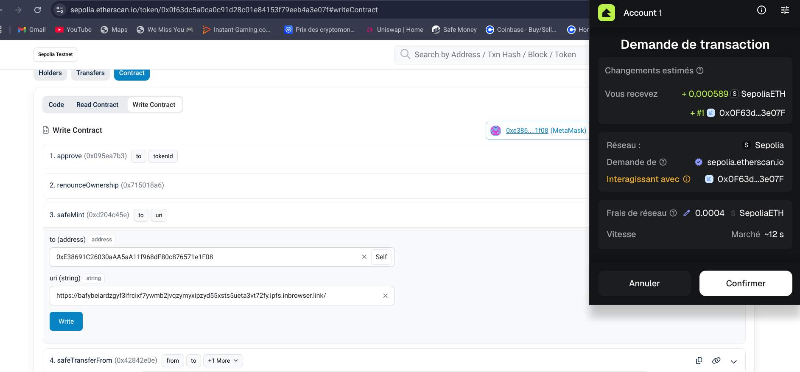

# tokenizerArt - NFT Project

nft : https://bafybeiardzgyf3ifrcixf7ywmb2jvqzymyxipzyd55xsts5ueta3vt72fy.ipfs.inbrowser.link/

## 📝 Project Overview
This repository contains the source code and architecture choices for **tokenizerArt**, a project dedicated to creating, deploying, and demonstrating a secure Non-Fungible Token (NFT) on the blockchain. 

The project includes a fully documented Solidity smart contract, decentralized metadata storage, and a robust security architecture.

---

## 🛠️ Architectural Choices & Justifications

### 1. Blockchain Platform: Ethereum (Sepolia Testnet)
We chose the **Ethereum** ecosystem for this project. 
* **Why?** It is the pioneer and industry standard for decentralized applications (dApps) and NFTs. It offers mature tooling, extensive documentation, and native compatibility with all major marketplaces.
* **Network:** Deployed on the **Sepolia Testnet** to simulate a real production environment without incurring actual gas fees in ETH.

### 2. Token Standard: ERC-721 (via OpenZeppelin)
To comply with Ethereum standards, the token implements the **ERC-721** standard, specifically inheriting from OpenZeppelin's `ERC721URIStorage`.
* **Why ERC-721?** Unlike ERC-1155 (which is built for multi-tokens or semi-fungible items), ERC-721 is the easiest and most explicit standard for strictly unique, 1-of-1 digital artworks.
* **Why OpenZeppelin?** It provides battle-tested, community-audited code templates. Re-implementing low-level token logic increases the attack surface for exploits.

-forge install openzeppelin/openzeppelin-contracts to install them

###### Doc 

[openZeppelin](https://docs.openzeppelin.com/)

### 3. Development Tools & Ecosystem: Hardhat / Remix
* **Framework:** **foundry** explication of foundry down there.
* **Language:** **Solidity (^0.8.20)**. Using a modern compiler version ensures native protection against arithmetic overflows/underflows without needing external libraries like SafeMath.


---

##  Metadata Architecture (IPFS)

In accordance with strict decentralized principles, the art asset and its attributes are **not** stored directly on-chain (which would be prohibitively expensive). Instead, they are stored using **IPFS (InterPlanetary File System)**, ensuring cryptographic immutability through Content Identifiers (CIDs).

### Metadata Specifications
* **Artist Name (Login):** 
* **Token Name:** 

### `metadata.json` Structure
```json
{
	"name": "tokenizerArt #42 - Neon Beach",
	"description": "A unique vaporwave NFT artwork generated for the tokenizerArt project, blending decentralized code structures, a tropical beach vibe, and the ultimate number 42.",
	"image": "ipfs://cid",
	"attributes": [
	  {
		"trait_type": "Collection",
		"value": "tokenizerArt"
	  },
	  {
		"trait_type": "Theme",
		"value": "Vaporwave Beach"
	  },
	  {
		"trait_type": "artiste",
		"value": "csalamit"
	  },
	  {
		"trait_type": "Legendary Number",
		"value": "42"
	  }
	]
  }

## Foundry

**Foundry is a blazing fast, portable and modular toolkit for Ethereum application development written in Rust.**

Foundry consists of:

- **Forge**: Ethereum testing framework (like Truffle, Hardhat and DappTools).
- **Cast**: Swiss army knife for interacting with EVM smart contracts, sending transactions and getting chain data.
- **Anvil**: Local Ethereum node, akin to Ganache, Hardhat Network.
- **Chisel**: Fast, utilitarian, and verbose solidity REPL.

## Documentation

https://book.getfoundry.sh/

## Usage

### Build

```shell
$ forge build
```

### Test

```shell
$ forge test
```

### Format

```shell
$ forge fmt
```

### Gas Snapshots

```shell
$ forge snapshot
```

### Anvil

```shell
$ anvil
```

### Deploy

```shell
$ forge script script/Counter.s.sol:CounterScript --rpc-url <your_rpc_url> --private-key <your_private_key>
```

### Cast

```shell
$ cast <subcommand>
```

### Help

```shell
$ forge --help
$ anvil --help
$ cast --help
```


# deploy proof 

csalamithome@penguin:~/TokenizeArt$ source .env
forge script mint/NeonBeach.s.sol:NeonBeachScript --fork-url "$SEPOLIA_RPC_URL" --broadcast --verify --etherscan-api-key "$ETHERSCAN_API_KEY" -vvvv
[⠊] Compiling...
No files changed, compilation skipped
Traces:
  [2235461] NeonBeachScript::run()
    ├─ [0] VM::envUint("PRIVATE_KEY") [staticcall]
    │   └─ ← [Return] <env var value>
    ├─ [0] VM::envString("MY_NFT_CID") [staticcall]
    │   └─ ← [Return] <env var value>
    ├─ [0] VM::startBroadcast(<pk>)
    │   └─ ← [Return]
    ├─ [2026343] → new NeonBeach@0x0F63dc5A0cA0c91d28c01E84153f79EEb4a3e07F
    │   ├─ emit OwnershipTransferred(previousOwner: 0x0000000000000000000000000000000000000000, newOwner: 0xE38691C26030aAA5aA11f968dF80c876571e1F08)
    │   └─ ← [Return] 9774 bytes of code
    ├─ [0] VM::addr(<pk>) [staticcall]
    │   └─ ← [Return] 0xE38691C26030aAA5aA11f968dF80c876571e1F08
    ├─ [161571] NeonBeach::safeMint(0xE38691C26030aAA5aA11f968dF80c876571e1F08, "ipfs://bafybeiardzgyf3ifrcixf7ywmb2jvqzymyxipzyd55xsts5ueta3vt72fy")
    │   ├─ emit Transfer(from: 0x0000000000000000000000000000000000000000, to: 0xE38691C26030aAA5aA11f968dF80c876571e1F08, tokenId: 0)
    │   ├─ emit MetadataUpdate(_tokenId: 0)
    │   └─ ← [Stop]
    ├─ [0] VM::stopBroadcast()
    │   └─ ← [Return]
    └─ ← [Stop]


Script ran successfully.

## Setting up 1 EVM.
==========================
Simulated On-chain Traces:

  [2026343] → new NeonBeach@0x0F63dc5A0cA0c91d28c01E84153f79EEb4a3e07F
    ├─ emit OwnershipTransferred(previousOwner: 0x0000000000000000000000000000000000000000, newOwner: 0xE38691C26030aAA5aA11f968dF80c876571e1F08)
    └─ ← [Return] 9774 bytes of code

  [163571] NeonBeach::safeMint(0xE38691C26030aAA5aA11f968dF80c876571e1F08, "ipfs://bafybeiardzgyf3ifrcixf7ywmb2jvqzymyxipzyd55xsts5ueta3vt72fy")
    ├─ emit Transfer(from: 0x0000000000000000000000000000000000000000, to: 0xE38691C26030aAA5aA11f968dF80c876571e1F08, tokenId: 0)
    ├─ emit MetadataUpdate(_tokenId: 0)
    └─ ← [Stop]


==========================

Chain 11155111

Estimated gas price: 2.083238668 gwei

Estimated total gas used for script: 3195605

Estimated amount required: 0.00665720790365414 ETH

==========================

##### sepolia
✅  [Success] Hash: 0xb6299ab896d0af12407d5c404607aa85858557b8f610596ede678c7235666d31
Contract Address: 0x0F63dc5A0cA0c91d28c01E84153f79EEb4a3e07F
Block: 10956883
Paid: 0.002458527904212506 ETH (2248393 gas * 1.093460042 gwei)


##### sepolia
✅  [Success] Hash: 0xe904e7a2025bc10a4a5d9b22e3c73cd90416b5ac5ecaef4f441f76ccbeb941ec
Block: 10956883
Paid: 0.000203885465971278 ETH (186459 gas * 1.093460042 gwei)

✅ Sequence #1 on sepolia | Total Paid: 0.002662413370183784 ETH (2434852 gas * avg 1.093460042 gwei)
                                                                                                                                                                                                                   

==========================

ONCHAIN EXECUTION COMPLETE & SUCCESSFUL.
##
Start verification for (1) contracts
Start verifying contract `0x0F63dc5A0cA0c91d28c01E84153f79EEb4a3e07F` deployed on sepolia
EVM version: prague
Compiler version: 0.8.33

Submitting verification for [code/NeonBeach.sol:NeonBeach] 0x0F63dc5A0cA0c91d28c01E84153f79EEb4a3e07F.
Warning: Could not detect deployment: Unable to locate ContractCode at 0x0f63dc5a0ca0c91d28c01e84153f79eeb4a3e07f; waiting 5 seconds before trying again (4 tries remaining)

Submitting verification for [code/NeonBeach.sol:NeonBeach] 0x0F63dc5A0cA0c91d28c01E84153f79EEb4a3e07F.
Submitted contract for verification:
        Response: `OK`
        GUID: `3g2rtknksiadfkgpeagecmlfm4qtsxu1zuwgv5xa5srrckgerz`
        URL: https://sepolia.etherscan.io/address/0x0f63dc5a0ca0c91d28c01e84153f79eeb4a3e07f
Contract verification status:
Response: `NOTOK`
Details: `Pending in queue`
Warning: Verification is still pending...; waiting 15 seconds before trying again (7 tries remaining)
Contract verification status:
Response: `OK`
Details: `Pass - Verified`
Contract successfully verified
All (1) contracts were verified!

Transactions saved to: /home/csalamithome/TokenizeArt/broadcast/NeonBeach.s.sol/11155111/run-latest.json

Sensitive values saved to: /home/csalamithome/TokenizeArt/cache/NeonBeach.s.sol/11155111/run-latest.json

# Anvil

write | anvil  | in yout terminal , it is like a false blockchain
open a new terminal and write | forge create code/NeonBeach.sol:NeonBeach --rpc-url http://127.0.0.1:8545 --private-key aPrivateKey




# FRONTEND

html - css -javascript - ether.js